# Домашнее задание 3

## Вкладка кампании
url: https://ads.vk.com/hq/dashboard
- Если у пользователя нет кампаний, то на странице будет предложение создать кампанию: 
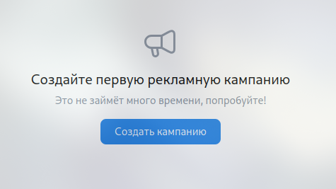
  - При нажатии на кнопку "Создать кампанию" осуществляется переход на страницу создания кампании
- Если у пользователя есть кампании, то, в соответствующих вкладках, будут показаны созданные кампаниям/группам объявлений/объявлениям и краткая информация по нима (название, статус, бюджет, ...): 
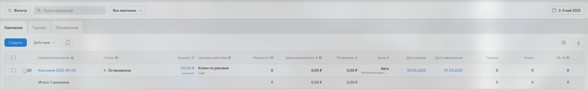
- Нажав на ползунок, можно поменять статус компанию:
  - После нажатия на ползунок, статус меняется на "Остановлена" 
  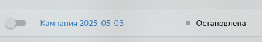
  - При повторном нажатии, статус меняется на "Действующая" 
  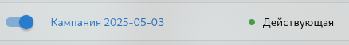
- При нажатии на кнопку "Фильтр" открывается меню с параметрами фильтрации: 
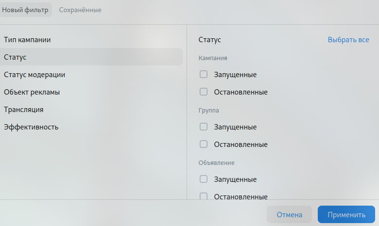
  - После нажатия на кнопку "Применить" результаты будут с учетом фильтра
  - Если ничего не будет найдено, об этом будет написано: 
  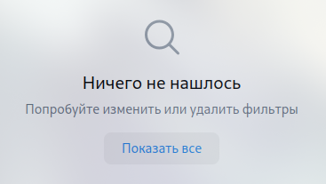

## Создание кампании

### Вкладка "Настройка кампании"
- При наведение на поле формы сверху появляется поле ввода, через которое можно поменять название:
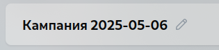 
  - измененное название сохраняется
- В зависимости от того, какая кнопка в селекторе "Что будете рекламировать?" будет нажата, будут выбираться соответствующие поля форм:
*формы для "Сайт"* 
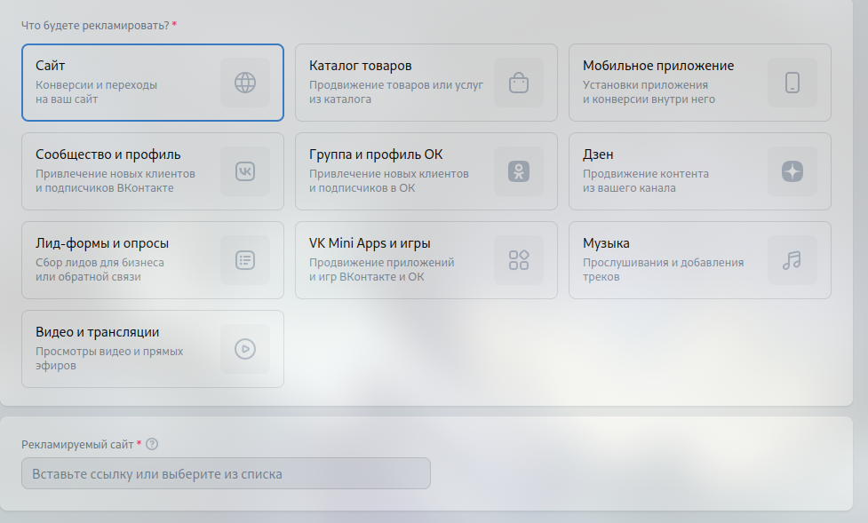
*формы для "Каталог товаров"* 
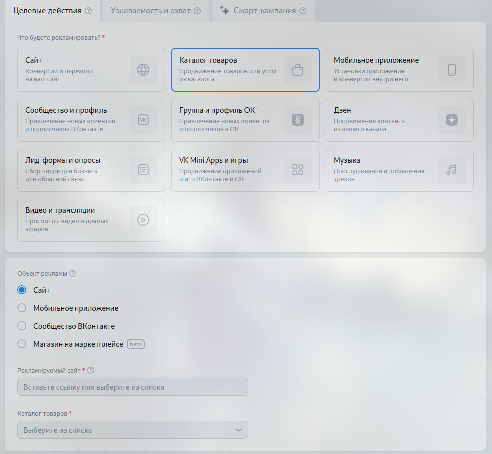
- Если ввести неверную информацию (невалидный url, невалидный email, ...) в форму, то форма подсветится: 
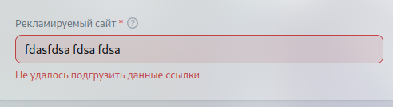
- При вводе корректной информации (правильный url, правильный email, ...) появляются дополнительные поля: 
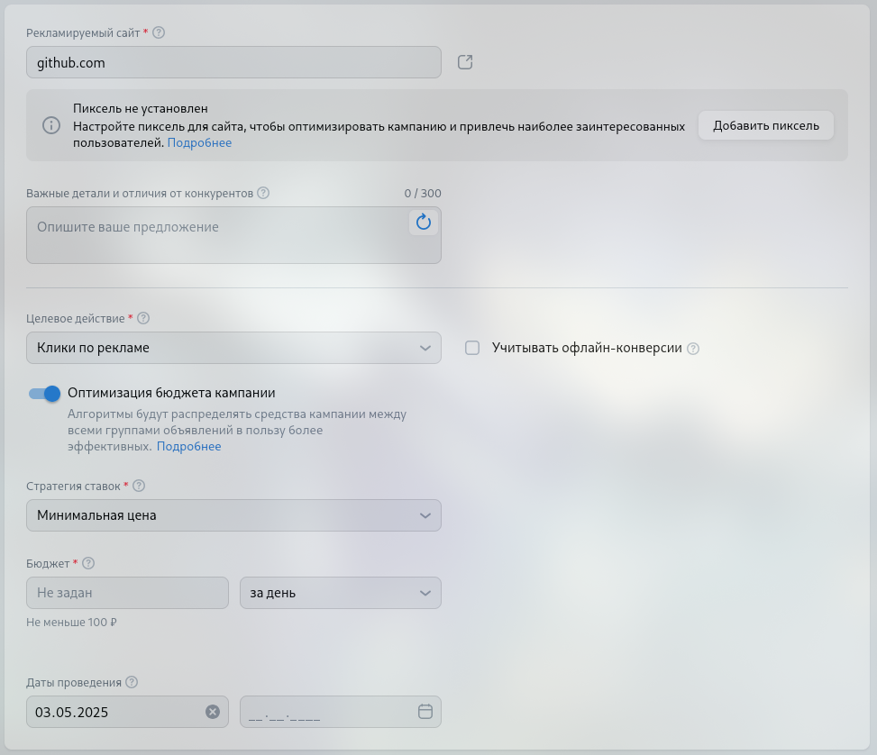
- После успешного заполнения форм, при нажатии на "Продолжить", переходим во вкладку "Группы объявлений" 
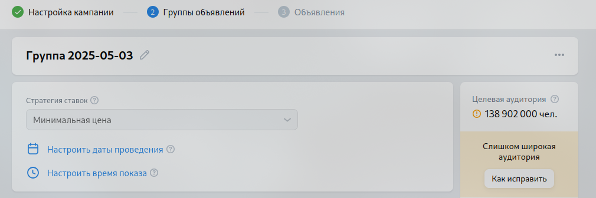

### Вкладка "Группы объявлений"
- При наведение на поле формы сверху появляется поле ввода, через которое можно поменять название:
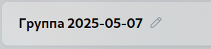 
  - измененное название сохраняется
- Можно выбрать определенный регион показа: 
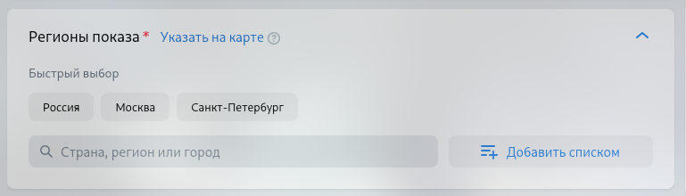
  - После выбора регион, можно удалить, нажав на крестик 
  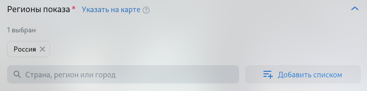
- При вводе региона в поле для поиска появляются нужные регионы: 
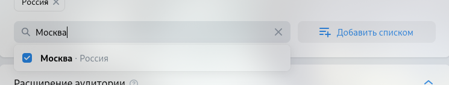
- Каждый раздел можно раскрыть, после раскрытия появляются дополнительные поля: 
*Раздел демография до раскрытия* 
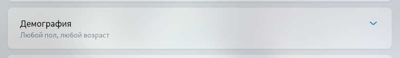
*Раздел демография после раскрытия* 
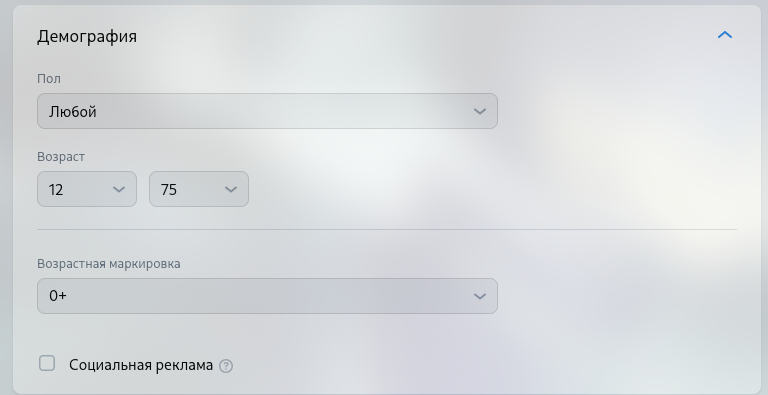
- Если нажать кнопку "Добавить еще группу", будет добавлена дополнительная группа, она отобразится в боковой панели: 
*кнопка "Добавить еще группу"* 
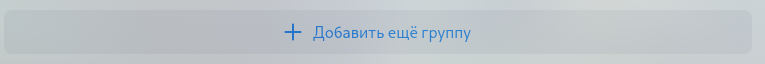
*после нажатия на кнопку "Добавить еще группу" добавилась новая группа* 
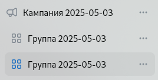
- После успешного заполнения форм, при нажатии на "Продолжить", переходим во вкладку "Объявления"

### Вкладка "Объявления"
- При наведение на поле формы сверху появляется поле ввода, через которое можно поменять название:
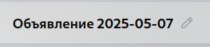 
  - измененное название сохраняется
- Можно загрузить другой логотип нажатием на кнопку "Заменить": 
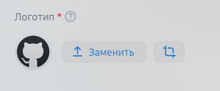
  - После нажатия на кнопку "Заменить" появляется окно для загрузки: 
  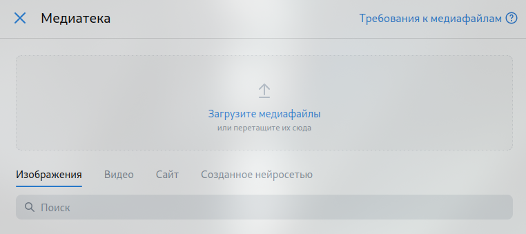
- Информация в блоке "Предпросмотр" совпадает с введенной: 
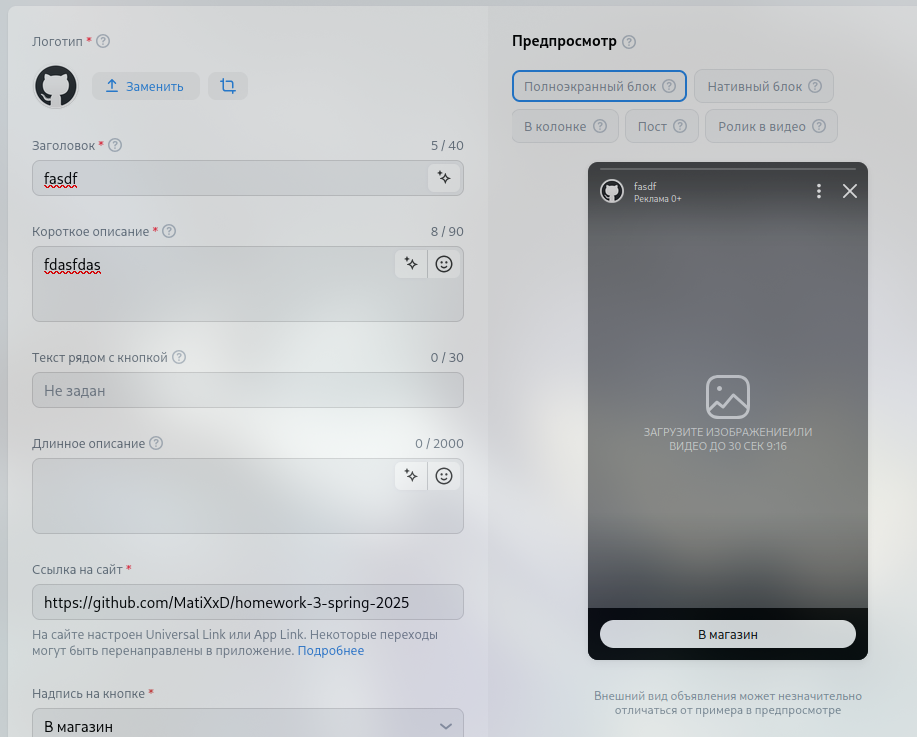
- После заполнения всех необходимых полей (с красной звездочкой), можно опубликовать объявленияе:
  - В случае ошибки должно сверху страницы появляется надпись, в которой описана ошибка 
  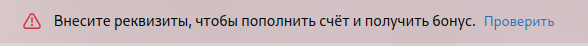
- Можно сохранить черновик объявления, нажав на кнопку "Сохранить черновик": 
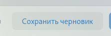
  - После нажатия на кнопку "Сохранить черновик", появляется уведомление "Изменения сохранены": 
  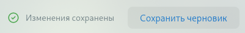
  - В случае успеха осуществляется переход на страницу кампаний: 
  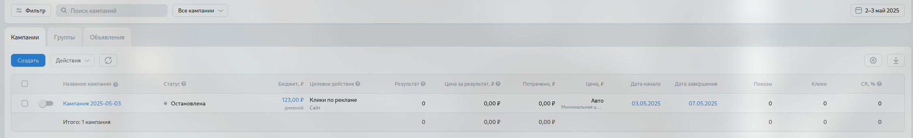

### Боковая панель
Боковая панель содержит информацию по всем кампаниям, у каждой кампании есть группа объявлений, у каждой группы объявлений есть объявления.

- Слева все группы объявлений и объявления для кампании: 
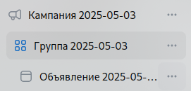
- При нажатии на кнопку "..." появится меню с действиями, которые можно сделать с кампанией/группой объявлений/объявлением: 
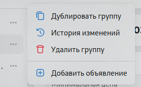
  - При нажатии на "Дублировать группу/объявление" создается копия группы/объявления
  - При нажатии на "Удалить группу/объявление" группа/объявление удаляется
- При нажатии на кнопку "Показать удалённые" тусклым цветом будет показаны удаленные элементы: 
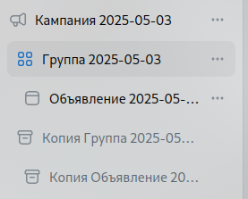
  - Кнопка "Показать удалённые" поменяется на "Скрыть удалённые"